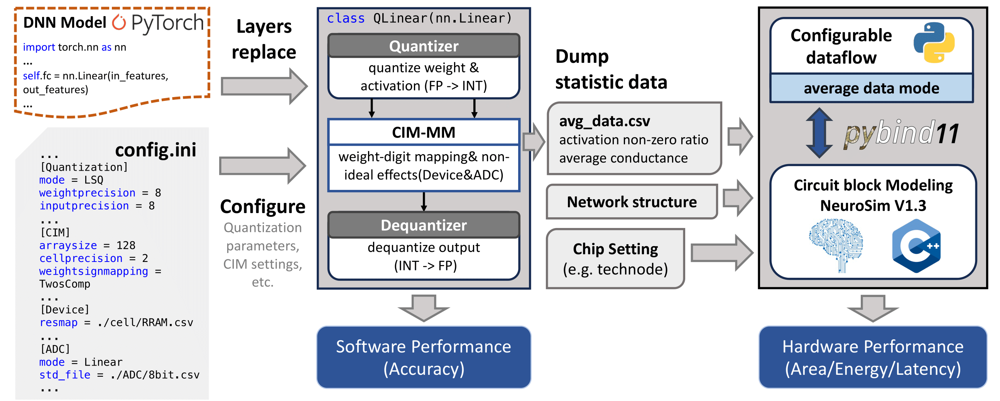

# MICSim V1.0

- [MICSim V1.0](#micsim-v10)
  - [Overview](#overview)
  - [Installation](#installation)
      - [1. Get the tool from GitHub](#1-get-the-tool-from-github)
      - [2. Create a new virtual environment and install the requirements](#2-create-a-new-virtual-environment-and-install-the-requirements)
      - [3. Compile the NeuroSim v1.3 Backend](#3-compile-the-neurosim-v13-backend)
      - [4. Add Compiled NeuroSim to the Environment](#4-add-compiled-neurosim-to-the-environment)
      - [5. Test and verify](#5-test-and-verify)
  - [File Structure](#file-structure)
  - [Usage](#usage)
      - [1. Replace Layers](#1-replace-layers)
      - [2. Configure the settings of Software Performance](#2-configure-the-settings-of-software-performance)
      - [3. Run Software Performance Test](#3-run-software-performance-test)
      - [4. Run Hardware Performance Test](#4-run-hardware-performance-test)
  - [Citation](#citation)
  - [Contributing](#contributing)
  - [Contact](#contact)

## Overview

This is the code of the paper:  **MICSim: A Modular Simulator for Mixed-signal Compute-in-Memory based AI Accelerator**, [30th Asia and South Pacific Design Automation Conference(**ASP-DAC**)](https://www.aspdac.com/aspdac2025/index.html), 2025. [arxiv](https://arxiv.org/abs/2409.14838)

MICSim is an open-source pre-circuit simulator designed to assist circuit designers evaluate early-stage chip-level software performance and hardware overhead of mixed-signal compute-in-memory(CIM) accelerators.



## Installation

The development and testing environment for this project is based on **Linux Ubuntu 20.04**. The installation steps are as follows:

#### 1. Get the tool from GitHub

```bash
$ git clone git@github.com:wangc0812/CIMSim_V1.0.git
$ cd CIMSim_V1.0
```

#### 2. Create a new virtual environment and install the requirements

```bash
$ conda env create -f environment.yml
$ conda activate MICSim
```

Conda will automatically create an environment named ``MICSim`` and install all the packages listed in the file.

#### 3. Compile the NeuroSim v1.3 Backend

To compile the **NeuroSim v1.3** backend using `pybind11`, run the following command:

```bash
$ cd ./Performance/NeuroSim
$ python3.8 setup.py build
```

***Note:** you need to modify the ``include_dirs``  in ``./Performance/NeuroSim/setup.py`` based on your pybind11 path*

After compile NeuroSim backend successfully, a file named ``neurosim.cpython-38-x86_64-linux-gnu.so`` is supposed to be found at ``./Performance/NeuroSim/build/lib.linux-x86_64-cpython-38/`` folder.

#### 4. Add Compiled NeuroSim to the Environment

Open the `.bashrc` file:

```bash
$ vim ~/.bashrc
```

Add the following line at the end of the file, replacing `/PATH/PerformanceNeuroSim/build/lib.linux-x86_64-cpython-38` with the actual path to your compiled NeuroSim library:

```bash
export PYTHONPATH=$PYTHONPATH:/PATH/PerformanceNeuroSim/build/lib.linux-x86_64-cpython-38
```

Save the file and restart your terminal.

#### 5. Test and verify

To test the software performance, run the following script:

```bash
$ python script_example/accuracy/main-cnn.py 
```

To test the hardware performance, run the following script:

```bash
$ python script_example/performance/main_cnn.py
```

## File Structure

This project is organized as follows:

```tex
- Accuracy                # Software performance Evaluation
    - config              # Configuration files
    - src                 # Implementation code for accuracy evaluation
        - Component       # ADC and Device configuration files
        - Layers  
        - Modules   
        - Network         # Model network definition
        - self_optimizer  # Custom optimizer implementation
        - utils   
- average_files           # Generated statistics data files
- log                     # Logs of model training and testing
- Performance             # Hardware performance Evaluation
    - NeuroSim            # NeuroSim backend
    - src                 # Implementation code for CIM performance evaluation
- saved_model             # Saved pretrained models
- script_example          # example scripts for reference
    - accuracy            # scripts for software performance evaluation
    - performance         # scripts for hardware performance evaluation
```

## Usage

This project enables testing of both software and hardware performance by integrating a quantized DNN model with NeuroSim v1.3 using `pybind11`. The following steps guide you through the process.

#### 1. Replace Layers

As to PyTorch-based DNN model, replace standard layers (such as `nn.Linear` and `nn.Conv`) with quantized layers (`QLinear` and `QConv`). These quantized layers are fully compatible with PyTorch's `nn.Linear` and `nn.Conv`, so you can directly replace them without changing the interface.

#### 2. Configure the settings of Software Performance

Below are some of the key options from the configuration file (`config.ini`) that you can adjust to control the quantization process and CIM settings.

```ini
[Quantization]
mode = LSQ                      # Quantization mode (e.g., LSQ, WAGE.)
weightprecision = 8             # Bit precision for weights
inputprecision = 8              # Bit precision for inputs (activations)
weightsignmapping = TwosComp	# weight-digit mapping(TwosComp, NPsplit)
inputsignmapping = TwosComp
weightmapping = Sign		# Sign / Unsign
inputmapping = Sign
hardware = True			# whether consider the non-ideal effect introduced by CIM
dumpaveragevalue = False	# whether dump the statistics data files
dumpaveragevalue_path = ./  	# Path of the dumped statistics data files
```

MICSim offers three types of circuit architecture designs:

1. Design1: 2’s complement-like  ``weightsignmapping = TwosComp`` and ``weightmapping = Sign``
2. Design2: positive-negative split* ``weightsignmapping = TwosComp`` and ``weightmapping = Sign``
3. Design3: weight-shifted: ``weightmapping = Unsign`` ,``weightmapping `` will be ignored.


***We  also provide a `config_example.ini` file that gives a detailed explanation of the configuration options involved in accuracy testing. You can find it at `Accuracy/config/config_example.ini`.***

#### 3. Run Software Performance Test

To evaluate the software performance (accuracy) of the quantized DNN model, run the following script:

```bash
$ python script_example/accuracy/main-cnn.py
```

This will test the model’s accuracy and dump the statistical data (e.g., `avg_data.csv` for non-zero activation ratio and average conductance) for each targeted layer.

#### 4. Run Hardware Performance Test

Modify the script according to the network structure and the path of the average file, and set the configuration file `Performance/src/Configuration.py`.

***Note**: The definition of the network structure parameters can be found in `Performance/src/CNN/Layer.py`.*

After that, run the following script to get the evualtion result:

```bash
$ python script_example/performance/main_cnn.py
```

## Citation

If you use this github repository, please cite our paper:

**MICSim: A Modular Simulator for Mixed-signal Compute-in-Memory based AI Accelerator**

<u>*Cong Wang, Zeming Chen, Shanshi Huang*</u>

```tex
@misc{wang2024micsimmodularsimulatormixedsignal,
      title={MICSim: A Modular Simulator for Mixed-signal Compute-in-Memory based AI Accelerator}, 
      author={Cong Wang and Zeming Chen and Shanshi Huang},
      year={2024},
      eprint={2409.14838},
      archivePrefix={arXiv},
      primaryClass={cs.AI},
      url={https://arxiv.org/abs/2409.14838}, 
}
```


## Contributing

Contributions are welcome! Please open an issue or submit a pull request.

## Contact 
If you have any questions or suggestions, feel free to reach out to us: <micsim0908@hotmail.com>
